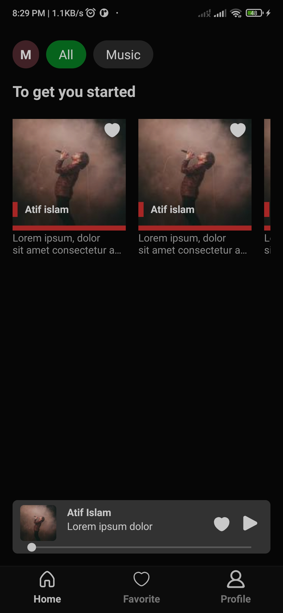
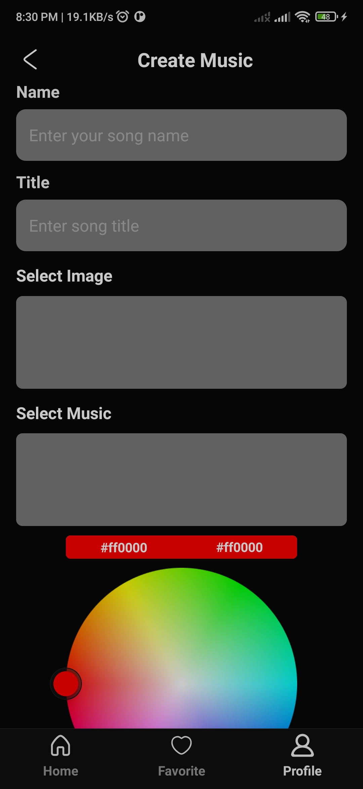

# Spotify Music App Clone

## Overview

The Spotify Music App Clone is a comprehensive music streaming application that allows users to sign up, log in, upload and listen to music, make favorite tracks, search for music, and enjoy background play. The app is developed using two different frameworks, React Native and Flutter, both following the MVVM architecture with Riverpod for state management. The backend is powered by NestJS, which handles file uploads and music streaming, with PostgreSQL as the database.

## Projects

| #SL | Name         | Code                                                                     | Demo     |
| --- | ------------ | ------------------------------------------------------------------------ | -------- |
| 01  | React Native | [Link](https://github.com/DeveloperRejaul/react-native-online-music-app) | [Link]() |
| 02  | Flutter      | [Link](https://github.com/DeveloperRejaul/flutter-online-music-app)      | [Link]() |
| 03  | Server       | [Link](https://github.com/DeveloperRejaul/nodejs-music-streaming-server) | [Link]() |

## Features

- **User Authentication**: Sign up and log in with JWT authentication.
- **Music Upload**: Users can upload their music files to the platform.
- **Music Streaming**: Stream music with a seamless and high-quality playback experience.
- **Favorites**: Users can mark their favorite tracks for easy access.
- **Search**: Search for music by title, artist, or album.
- **Background Play**: Continue listening to music even when the app is in the background.

## Technologies Used

### Frontend

- **React Native**
- **Flutter**
- **MVVM Architecture**
- **Riverpod for State Management**

### Backend

- **NestJS**
- **PostgreSQL**

## Installation

# Backend

1. Clone the repository:

```
git clone https://github.com/DeveloperRejaul/nodejs-music-streaming-server
cd nodejs-music-streaming-server
```

2. Install dependencies Install dependencies:

```
npm i -g @nestjs/cli
npm install
```

3. Set up environment variables:
   Create a `.env` file in the root directory and add the following:

```
DATABASE_URL=your_postgresql_database_url
JWT_SECRET=your_jwt_secre
```

4. Run the server:

```
yarn dev
or
pnpm run dev
or
npm run dev
```

### Frontend

#### React Native

1. Clone the repository:

```
git clone https://github.com/DeveloperRejaul/react-native-online-music-app
cd react-native-online-music-app
```

2. Install dependencies:

```
npm install
```

3. Run the app:

```
npx expo start -c
```

### Frontend

#### Flutter

1. Clone the repository:

```
git clone https://github.com/DeveloperRejaul/flutter-online-music-app
cd flutter-online-music-app
```

2. Install dependencies:

```
flutter pub get
```

3. Run the app:

```
flutter run
```

# Demo

<p>








</p>

## Contributing

Contributions are welcome! Please fork the repository and submit a pull request with your changes.

## License

This project is licensed under the MIT License.
